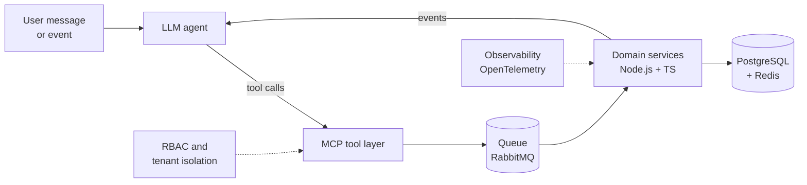

<div align="center">


<a href="https://git.io/typing-svg"></a>

<p>
<a href="mailto:sunilgawaiofficial@gmail.com"></a>
<a href="https://www.linkedin.com/in/dvlpr_sunil"></a>
<a href="https://developer-portfolio-i6zl.vercel.app"></a>
<a href="https://www.github.com/sunilgawai"></a>
</p>

</div>

---

### `$ whoami`

```python
class SunilGawai(AIAgentEngineer):
    """Backend engineer building the production layer that AI agents run on."""

    location   = "Pune, India 🇮🇳"
    experience = "2+ years in production · Full Stack Engineer @ Swift Business Solutions · ex-Wipro"
    stack      = ["TypeScript", "Node.js", "Python", "PostgreSQL", "Redis", "RabbitMQ", "Docker"]

    shipped = [
        "Stellar POS: 0→1 real-time retail platform across multiple store locations",
        "Multi-tenant operations platform serving 3 companies on shared infrastructure",
        "MCP server that lets Claude, Gemini and ChatGPT operate on a live codebase",
        "Transformer Atlas: interactive, tested model of attention and causal masking",
    ]

    building = ["LLM pipelines", "AI agent architectures", "MCP tooling", "OpenTelemetry", "Rust"]

    def why_me(self):
        return (
            "An agent is a distributed system with a language model inside it. "
            "Queues, retries, tenant isolation, access control and observability "
            "are what make it reliable, and that's what I've shipped in production."
        )

    def contact(self):
        return "sunilgawaiofficial@gmail.com"
```

### 🧠 What I build

| Area | What that means in practice |
|---|---|
| 🤖 **Agent tooling with MCP** | Model Context Protocol servers that give AI clients real tools: insert, search, list and remove code in a workspace |
| ⚙️ **Async pipelines for long-running work** | RabbitMQ and Redis pipelines that decouple producers from consumers, the backbone agent jobs need to survive load and failure |
| 🔐 **Guardrails before AI touches data** | Multi-tenant systems with tenant-level isolation and company-scoped RBAC, so every action stays inside its access boundary |
| ⚡ **High-throughput APIs** | Node.js and TypeScript REST APIs, tuned PostgreSQL schemas and query plans, Redis caching on hot paths |
| 🔗 **Event-driven integrations** | Webhook ingestion from Shopify, WooCommerce and Global Payments, processed through queues instead of inline |
| 🧮 **Model internals** | Attention, softmax normalisation and causal masking implemented and unit-tested, not just called through an API |

### 🚀 AI projects

<table>
<tr>
<td width="50%" valign="top">

#### [🔭 Transformer Atlas](https://github.com/sunilgawai/transformer-atlas)

An interactive learning studio that walks through the full Transformer architecture in 20 chapters. Tokens, attention maps, vectors and generation controls all stay in sync with one playback clock.

- Deterministic attention maths with causal masking
- Unit tests for the maths, Playwright tests for the UI

<a href="https://transformer-smoky.vercel.app"></a>


</td>
<td width="50%" valign="top">

#### 🛠️ Deep MCP Logger

A VS Code extension with a built-in MCP server. AI clients like Claude, Gemini and ChatGPT can insert, search, list and clean up log statements across a workspace.

- AST-aware edits across JS, TS, Python, PHP and Go
- Standalone MCP server with six tools


</td>
</tr>
<tr>
<td width="50%" valign="top">

#### [🕉️ Spiritual Guide AI](https://github.com/sunilgawai/www.spiritual-guide.ai-bot)

A conversational AI guide built on the Inworld AI character engine. Users chat with it in real time, with history, authentication and per-user API rate limits.

- Chat window with saved history
- NextAuth and Prisma for accounts, with rate limiting on the AI API


</td>
<td width="50%" valign="top">

#### 💬 Veyra: conversation-to-order platform

A multi-tenant B2B platform that turns WhatsApp messages like *"20 case Parle-G, 10 Marie, Thursday"* into priced, stock-checked, credit-checked orders and GST invoices.

- Pipeline: conversation → understanding → domain operation → event → automation
- 2,600+ tests across 13 packages, every package at 90%+ line coverage


</td>
</tr>
</table>

### 🛠️ Tech stack

**AI & agents**

<p>


</p>

**Backend, data & messaging**

<p>


</p>

**Frontend & mobile**

<p>


</p>

### 🔁 How I build an agent for production



### 📊 GitHub activity

<p align="center">


</p>
<p align="center">

</p>

### 🤝 Let's build something intelligent

I'm open to **AI Engineer** and **AI Agent Engineer** roles, especially teams taking LLM features from demo to production.

<p>
<a href="mailto:sunilgawaiofficial@gmail.com"></a>
<a href="https://www.linkedin.com/in/dvlpr_sunil"></a>
<a href="https://x.com/dvlpr_sunil"></a>
<a href="https://www.instagram.com/dvlpr_sunil"></a>
<a href="https://developer-portfolio-i6zl.vercel.app"></a>
</p>


