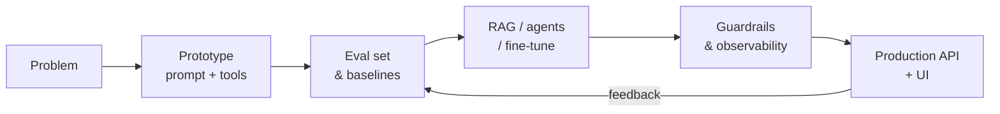

<div align="center">


<a href="https://git.io/typing-svg"></a>

<p>
<a href="mailto:sunilgawaiofficial@gmail.com"></a>
<a href="https://www.linkedin.com/in/sunil-gawai-350948233"></a>
<a href="https://developer-portfolio-i6zl.vercel.app"></a>
<a href="https://www.github.com/sunilgawai"></a>
</p>

</div>

---

### `$ whoami`

```python
class SunilGawai(AIEngineer):
    """I turn large language models into reliable, production-grade software."""

    location   = "Pune, India 🇮🇳"
    role       = "AI Engineer"
    focus      = ["LLM applications", "Autonomous agents", "RAG systems", "AI-native UX"]
    foundation = "Full-stack engineering — I ship the model, the API, and the interface"

    def approach(self):
        return [
            "Evals first: if it isn't measured, it isn't done",
            "Ground every answer: retrieval, citations, guardrails",
            "Design for cost, latency, and failure — not just the demo",
        ]

    def contact(self):
        return "sunilgawaiofficial@gmail.com"
```

### 🧠 What I build

| Area | What that means in practice |
|---|---|
| 🤖 **Agentic systems** | Tool-calling agents, multi-step planning, function calling, and MCP integrations that act on real data |
| 📚 **RAG pipelines** | Chunking, embeddings, vector search, re-ranking, and grounded answers with citations |
| 🧪 **LLM evaluation** | Test sets, regression evals, and observability so model changes don't silently break things |
| ⚡ **Production AI APIs** | Streaming endpoints, caching, rate limiting, and cost/latency tuning with FastAPI and Node.js |
| 🎨 **AI-native interfaces** | Chat, copilots, and generative UI in React, Next.js, and React Native |

### 🛠️ Tech stack

**AI / ML**

<p>


</p>

**Backend & data**

<p>


</p>

**Frontend & mobile**

<p>


</p>

### 🔁 How I ship an AI feature



### 📊 GitHub activity

<div align="center">


</div>

### 🤝 Let's build something intelligent

I'm open to **AI Engineer** roles and collaborations on LLM products, agents, and applied AI.

<p>
<a href="mailto:sunilgawaiofficial@gmail.com"></a>
<a href="https://www.linkedin.com/in/sunil-gawai-350948233"></a>
<a href="https://x.com/dvlpr_sunil"></a>
<a href="https://www.instagram.com/dvlpr_sunil"></a>
<a href="https://hashnode.com/@TheEngineerBro.hashnode.dev"></a>
<a href="https://developer-portfolio-i6zl.vercel.app"></a>
</p>


